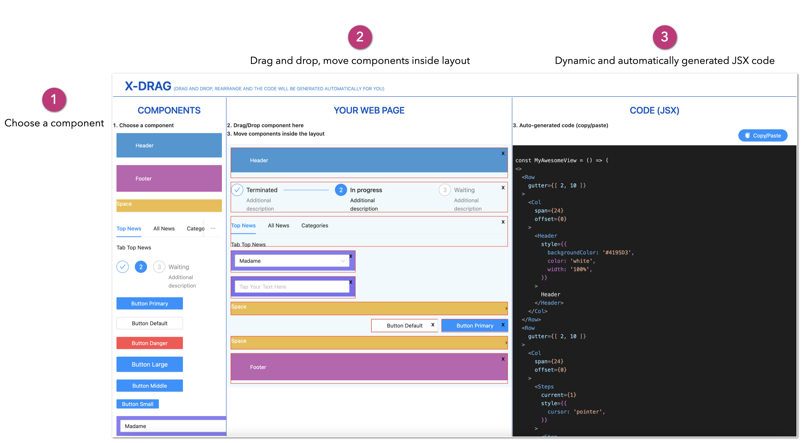

# x-drag-toolbox

## What's x-drag-toolbox ?
x-drag-toolbox allows you to: Drag and drop components, rearrange them and the code will change dynamically. You can easily copy & paste the code!

The idea is inspired by Xcode, Android Studio, Matlab Toolbox, ...
Have a way to dynamically and flexibly create an html view and get the corresponding code.

x-drag-toolbox uses antd components as a Design System. You can easily adapt it to your own by modifying the file [Tools](https://github.com/helabenkhalfallah/x-drag-toolbox/blob/main/src/toolbox/data/Tools.jsx#L1).

x-drag-toolbox use a grid of 24 columns.

x-drag-toolbox is fully written using Javascript and React !

**x-drag-toolbox :**
- Can help developers who want to start web development with React and don't know where to start.
- It's like a sketching tool.
- It's like an IDE.

## Supported platforms:

Actually **x-drag-toolbox** is only available for Chrome and Firefox and for desktop only.

## Next steps :
- Editable code : code -> design.
- Display a configuration palette according to the chosen component.
- Add more components.
- Make the change of components of the Design System more flexible.
- Enhance responsive.
